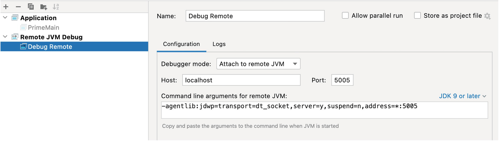

# Part II The Modern Production Environment - Chapter 6. Debugging Kubernetes

 
## Debugging sample code
* [PrimeMain](https://github.com/shai-almog/PrimeMain)
* [prime-app.js](https://gist.github.com/shai-almog/167a34571b0fae6eeed56742c44895cd)
* [prime_main.py](https://gist.github.com/shai-almog/8c8bbbb4297f758f7ce1d5f7a4cc1c74)
* [PrimeMainComplex.kt](https://gist.github.com/shai-almog/c454d39464ca2893c014807838c5102f)
* [PrimeMainMR.java](https://gist.github.com/shai-almog/e400134f01decc9639230a6a99d51eab)

# Java Application Remote Debugging
* [Reference1](https://www.baeldung.com/java-application-remote-debugging)
* [Reference2](https://www.jetbrains.com/help/idea/tutorial-remote-debug.html)
* [Reference3](https://javapapers.com/core-java/java-remote-debug-with-eclipse/)
* Java application add key parameter:  ``` -Xdebug -Xrunjdwp:transport=dt_socket,server=y,suspend=y,address=5005 ```

## Basics
Remote debugging is a feature of pretty much any programming language or platform, but it’s common in Java using the ``JDWP (Java Debug Wire Protocol)``, which I’ll discuss soon. It’s a wire-agnostic protocol that defines the connection between the IDE and the JVM when debugging.

Notice that the real value proposition of remote debugging is on local and not on a remote machine. The value is in connecting to a running process that’s outside of our development environment. It’s great for connecting to a container running on our machine. I’ll elaborate on this later in the chapter.

The ``java`` command we used to launch the preceding application will work almost perfectly for remote debugging if you’re running on a local machine without Kubernetes. For Kubernetes, it will fail. Kubernetes masks the networking ports by default. This lets us run servers that listen to network connections on the same port within the same machine, and they won’t collide with one another. In order to broadcast the port to external connectors, we need to expose that port; this is done via the manifest.

> **👉⚠ NOTE:**  **Don’t touch that manifest!** We don’t expose JDWP to the external world; this is a huge security vulnerability (more on that later). The trick we used to do in the days before Kubernetes is SSH tunneling using a command like this on your local machine:

```shell
ssh remoteUser@remoteHost -L 5005:127.0.0.1:5005 -N
```
This command links the port on the remote machine to the local machine. That means that port 5005 on ``localhost`` will map to port 5005 on the remote host. I would be able to debug the remote machine as if I’m working on a process running locally, and the server won’t expose any port. All traffic will be encrypted over SSH!


## Steps
* Step1. Java application's startup parameters add:  
```shell
java -Xdebug -Xrunjdwp:transport=dt_socket,server=y,suspend=y,address=5005 -jar target/demo.jar

Listening for transport dt_socket at address: 5005
```

* Step2. IDE's remote debugging run  , the console would be:

```
  .   ____          _            __ _ _
 /\\ / ___'_ __ _ _(_)_ __  __ _ \ \ \ \
( ( )\___ | '_ | '_| | '_ \/ _` | \ \ \ \
 \\/  ___)| |_)| | | | | || (_| |  ) ) ) )
  '  |____| .__|_| |_|_| |_\__, | / / / /
 =========|_|==============|___/=/_/_/_/
 :: Spring Boot ::               (v2.6.14)

2023-01-24 13:46:26.355  INFO 108447 --- [           main] com.example.demo.DemoApplication         : Starting DemoApplication v0.0.1-SNAPSHOT using Java 1.8.0_352 on 1204003PC01 with PID 108447 (/media/robert0714/DATA/robertData/workspaces/Intiellij/demo/target/demo.jar started by robert0714 in /media/robert0714/DATA/robertData/workspaces/Intiellij/demo)
2023-01-24 13:46:26.361  INFO 108447 --- [           main] com.example.demo.DemoApplication         : No active profile set, falling back to 1 default profile: "default"
2023-01-24 13:46:27.853  INFO 108447 --- [           main] o.s.b.w.embedded.tomcat.TomcatWebServer  : Tomcat initialized with port(s): 8080 (http)
2023-01-24 13:46:27.872  INFO 108447 --- [           main] o.apache.catalina.core.StandardService   : Starting service [Tomcat]
2023-01-24 13:46:27.872  INFO 108447 --- [           main] org.apache.catalina.core.StandardEngine  : Starting Servlet engine: [Apache Tomcat/9.0.69]
2023-01-24 13:46:27.955  INFO 108447 --- [           main] o.a.c.c.C.[Tomcat].[localhost].[/]       : Initializing Spring embedded WebApplicationContext
2023-01-24 13:46:27.956  INFO 108447 --- [           main] w.s.c.ServletWebServerApplicationContext : Root WebApplicationContext: initialization completed in 1500 ms
2023-01-24 13:46:28.577  INFO 108447 --- [           main] o.s.b.w.embedded.tomcat.TomcatWebServer  : Tomcat started on port(s): 8080 (http) with context path ''
2023-01-24 13:46:28.594  INFO 108447 --- [           main] com.example.demo.DemoApplication         : Started DemoApplication in 2.881 seconds (JVM running for 11.298)
2023-01-24 13:46:50.338  INFO 108447 --- [nio-8080-exec-1] o.a.c.c.C.[Tomcat].[localhost].[/]       : Initializing Spring DispatcherServlet 'dispatcherServlet'
2023-01-24 13:46:50.338  INFO 108447 --- [nio-8080-exec-1] o.s.web.servlet.DispatcherServlet        : Initializing Servlet 'dispatcherServlet'
2023-01-24 13:46:50.339  INFO 108447 --- [nio-8080-exec-1] o.s.web.servlet.DispatcherServlet        : Completed initialization in 1 ms

```
  
## Source Debugging in Kubernetes
* [Remote Debugging of Java Applications on OpenShift](https://dzone.com/articles/remote-debugging-of-java-applications-on-openshift)  
  
* Using jdb. (Java Debugger). ``jdb`` is a command-line debug interface for Java; essentially, it’s the equivalent of ``gdb``.
```yaml
  JAVA_OPTS: |
    -Xms1G 
    -Xmx1536m 
    -Xdebug 
    -Xrunjdwp:transport=dt_socket,server=y,suspend=y,address=5005 
```
* This won’t work on Kubernetes, though. For that, we will need to **port forward** using a slightly different command with the same impact: Use the cmd  ``port-forward``:
```shell
PODNAME=$( kubectl   get pods  --no-headers -o custom-columns=":metadata.name" --field-selector status.phase=Running |grep demo)
kubectl port-forward $PODNAME 5005:5005
```
Once we have that, we can connect our IDE to the remote server as if the code was running on our local machine. In IntelliJ/IDEA, all I need to do is open the Run/Debug configuration and add a “Remote JVM Debug” entry. The defaults should work as expected since it will point to the localhost on port 5005 as you can see in the below:
  
Figure 6-3 Remote debugging run configuration in IntelliJ/IDEA
### Weakness of JDWP & Local Debugging
* Need to restart process
* Breakpoints... Break...
* Insecure by Design
  * JDWP allows remote code execution. It lets you access all the bytecode of the server which is almost the same as giving access to your full server source code. It lets attackers do almost anything since it wasn’t designed with security in mind. It enables man-in-the-middle attacks and so much more.Most aren’t even encrypted by default. Just leaving JDWP enabled warrants a [CVE](https://nvd.nist.gov/vuln/detail/CVE-2018-5486).
* Stability Risk
* Privacy Nightmare

### K8s Debugging is Hard
* Massive Scale
* Massive Depth
* Barebone Container

# Koolkits
## Introduction
* https://learn.microsoft.com/zh-tw/events/jdconf-2022/debugging-at-scale-in-production-deep-into-your-containers-with-kubectl-debug-koolkits-and-co
* https://talktotheduck.dev/introducing-koolkits-oss-debugging-toolkits-for-kubernetes
* https://github.com/lightrun-platform/koolkits/
* cmd:
  ```shell
  git clone https://github.com/lightrun-platform/koolkits
  cd koolkits/jvm/
  docker build -t koolkit-jvm .
  PODNAME=$( kubectl   get pods  --no-headers -o custom-columns=":metadata.name" --field-selector status.phase=Running |grep demo)
  minikube -p cloud-run-dev-internal kubectl -- debug  -it  $PODNAME  --image=koolkit-jvm  --image-pull-policy=IfNotPresent --target=demo
  ```
  or 
  ```shell 
  docker build -f Dockerfile-koolkits -t koolkit-jvm  .
  PODNAME=$( kubectl   get pods  --no-headers -o custom-columns=":metadata.name" --field-selector status.phase=Running |grep demo)
  minikube -p cloud-run-dev-internal kubectl -- debug  -it  $PODNAME  --image=koolkit-jvm  --image-pull-policy=IfNotPresent --target=demo
  ```
### Weakness of ``kubectl debug``
* Privileged is not enough


