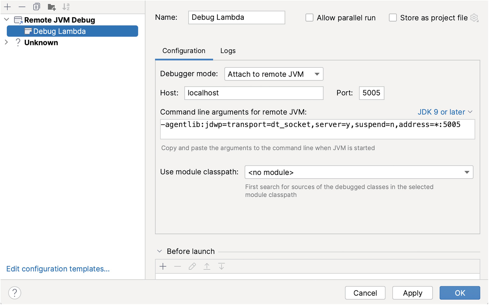
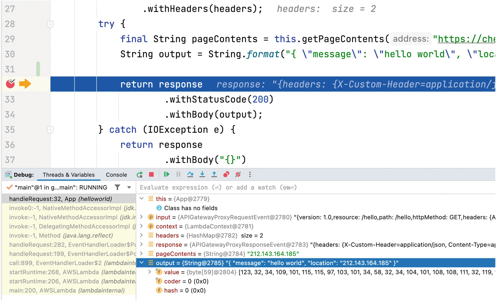

# Part II The Modern Production Environment - Chapter 7. Serverless Debugging
* [How to debug Lambda functions(NodeJS) with Visual Studio Code](https://sst.dev/examples/how-to-debug-lambda-functions-with-visual-studio-code.html)
* [MerLoc is a live AWS Lambda function development and debugging tool.](https://github.com/thundra-io/merloc)
## Debugging sample code
* Java sample code: [HelloLambda](https://github.com/shai-almog/HelloLambda) 

## Basics
In this chapter, I will focus on ``AWS Lambda``, which is popular and supports multiple languages, including Java. Most of the concepts that apply here would apply to other serverless frameworks as well.

## Local Debugging
* reference: [localstack](https://levelup.gitconnected.com/local-testing-aws-applications-at-no-cost-c0bdd009d1d0)
* Step1 [Deploying a Hello World application](https://docs.aws.amazon.com/serverless-application-model/latest/developerguide/serverless-getting-started-hello-world.html)
```shell
export AWS_DEFAULT_REGION='ap-south-1'

# Build your application
cd HelloLambda
sam build

# Deploy your application
$   samlocal deploy --guided

Configuring SAM deploy
======================

	Looking for config file [samconfig.toml] :  Not found

	Setting default arguments for 'sam deploy'
	=========================================
	Stack Name [sam-app]: HelloWorldFunction
	AWS Region [ap-south-1]: 
	#Shows you resources changes to be deployed and require a 'Y' to initiate deploy
	Confirm changes before deploy [y/N]: y
	#SAM needs permission to be able to create roles to connect to the resources in your template
	Allow SAM CLI IAM role creation [Y/n]: y
	#Preserves the state of previously provisioned resources when an operation fails
	Disable rollback [y/N]: y
	HelloWorldFunction may not have authorization defined, Is this okay? [y/N]: y
	Save arguments to configuration file [Y/n]: y
    
.....
```

We can run the hello world application using the sam command line:

```shell
$ sam local start-api

Mounting HelloWorldFunction at http://127.0.0.1:3000/hello [GET]
You can now browse to the above endpoints to invoke your functions. You do not need to restart/reload SAM CLI while working on your functions, changes will be reflected instantly/automatically. If you used sam build before running local commands, you will need to re-run sam build for the changes to be picked up. You only need to restart SAM CLI if you update your AWS SAM template
2023-01-25 05:27:09  * Running on http://127.0.0.1:3000/ (Press CTRL+C to quit)
Invoking helloworld.App::handleRequest (java11)
Local image was not found.
Removing rapid images for repo public.ecr.aws/sam/emulation-java11
Building image......................................................................................................................................................................................................................................
Using local image: public.ecr.aws/lambda/java:11-rapid-x86_64.
```

We use another terminal console:
```shell
$ curl http://127.0.0.1:3000/hello
{ "message": "hello world", "location": "218.35.189.66" }
```

This is already a valuable outcome. We can run tests locally and perform basic trial and error experiments. But this isn’t debugging.
To debug, we need to run the application using this command:
```shell
$ sam local start-api -d 5005 --debug
```
Once launched in this way, the application is paused. We can invoke ``curl``, but it won’t do anything. The debug mode waits for a debugger to connect before proceeding. To do that, we need to connect using remote debugging to the local host as explained in the previous chapter. We can add the run configuration in the IDE matching remote debugging to the localhost as seen in Figure 7-1. We can then debug in the IDE as shown in Figure 7-2.
  
Figure 7-1 IntelliJ/IDEA run configuration remote debug settings  
  
Figure 7-2 Debugging a serverless Lambda function in IntelliJ/IDEA

## Debugging JVM lambdas in localstack
* reference: https://docs.localstack.cloud/user-guide/tools/lambda-tools/debugging/
* You can not use vagrant to process remote debugging!
